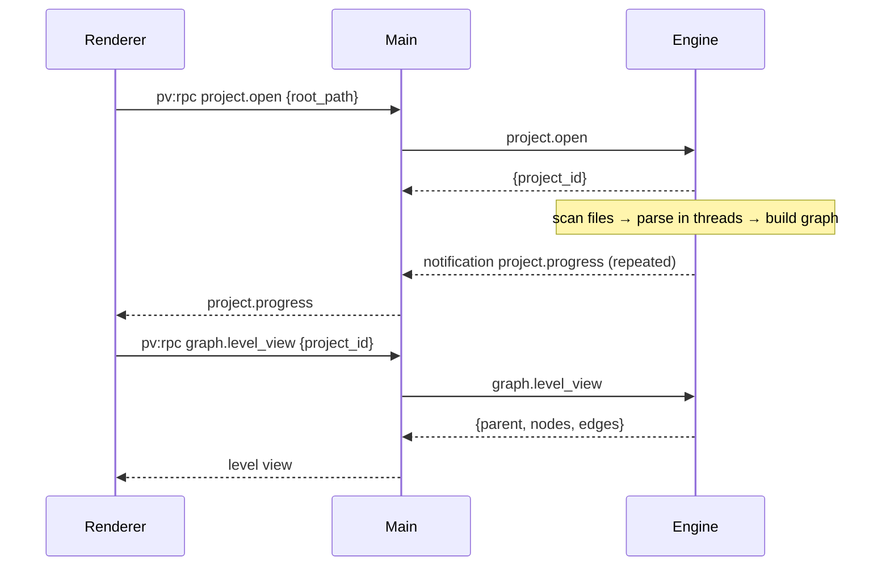
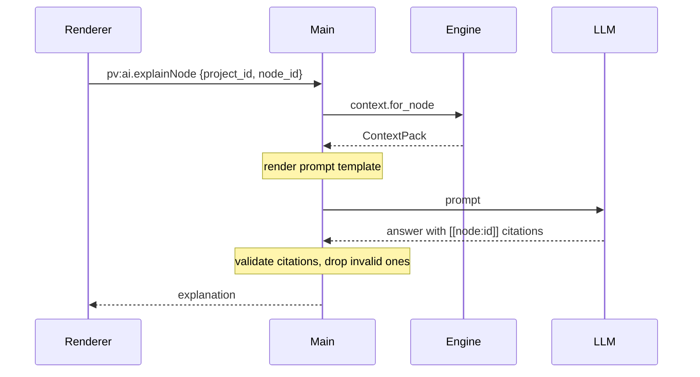
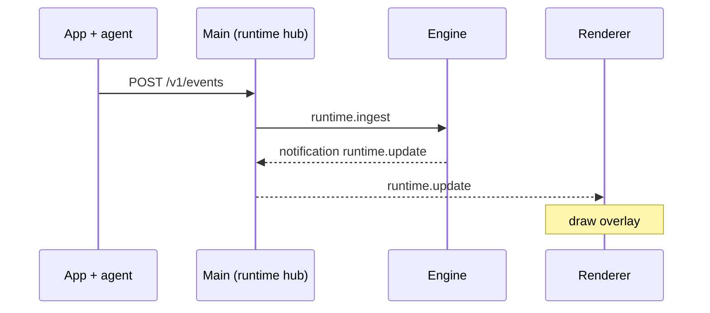
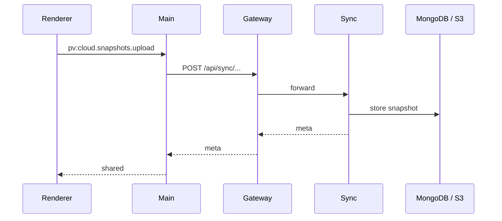

# Data and control flow

How data moves for the main scenarios.

## Import

```mermaid
sequenceDiagram
  participant R as Renderer
  participant M as Main
  participant E as Engine
  R->>M: pv:rpc project.open {root_path}
  M->>E: project.open
  E-->>M: {project_id}
  Note over E: scan files → parse in threads → build graph
  E-->>M: notification project.progress (repeated)
  M-->>R: project.progress
  R->>M: pv:rpc graph.level_view {project_id}
  M->>E: graph.level_view
  E-->>M: {parent, nodes, edges}
  M-->>R: level view
```

## Explain

```mermaid
sequenceDiagram
  participant R as Renderer
  participant M as Main
  participant E as Engine
  participant L as LLM
  R->>M: pv:ai.explainNode {project_id, node_id}
  M->>E: context.for_node
  E-->>M: ContextPack
  Note over M: render prompt template
  M->>L: prompt
  L-->>M: answer with [[node:id]] citations
  Note over M: validate citations, drop invalid ones
  M-->>R: explanation
```

## Runtime

```mermaid
sequenceDiagram
  participant A as App + agent
  participant M as Main (runtime hub)
  participant E as Engine
  participant R as Renderer
  A->>M: POST /v1/events
  M->>E: runtime.ingest
  E-->>M: notification runtime.update
  M-->>R: runtime.update
  Note over R: draw overlay
```

## Cloud share

```mermaid
sequenceDiagram
  participant R as Renderer
  participant M as Main
  participant G as Gateway
  participant S as Sync
  participant D as MongoDB / S3
  R->>M: pv:cloud.snapshots.upload
  M->>G: POST /api/sync/...
  G->>S: forward
  S->>D: store snapshot
  S-->>G: meta
  G-->>M: meta
  M-->>R: shared
```
