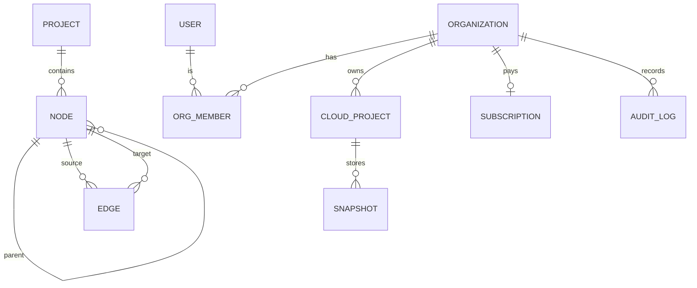

# Relationships

```mermaid
erDiagram
  PROJECT ||--o{ NODE : contains
  NODE ||--o{ NODE : parent
  NODE ||--o{ EDGE : source
  NODE ||--o{ EDGE : target
  ORGANIZATION ||--o{ ORG_MEMBER : has
  USER ||--o{ ORG_MEMBER : is
  ORGANIZATION ||--o{ CLOUD_PROJECT : owns
  CLOUD_PROJECT ||--o{ SNAPSHOT : stores
  ORGANIZATION ||--o| SUBSCRIPTION : pays
  ORGANIZATION ||--o{ AUDIT_LOG : records
```
